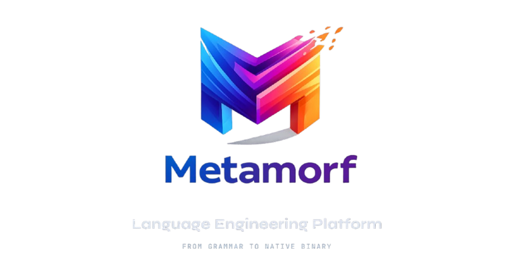

<div align="center">



<br>

[](https://discord.gg/Wb6z8Wam7p) [](https://bsky.app/profile/tinybiggames.com)

</div>

## What is Metamorf?

**Metamorf** is a Turing complete programming language for building compilers. You describe a complete programming language in a `.mor` file, covering tokens, types, grammar rules, semantic analysis, and C++23 code generation. Metamorf reads that file and immediately uses it to compile source files to native Win64/Linux64 binaries via Zig/Clang.

```bash
Mor -l pascal.mor -s hello.pas -r
```

One file defines your language. One command compiles and runs your program.

## Why Metamorf?

Most language definition tools (YACC, ANTLR, traditional BNF grammars) give you a declarative grammar and then punt to a host language for anything non-trivial. Metamorf is different. It is a **complete, Turing complete language** with variables, assignment, unbounded loops, conditionals, arithmetic, string operations, and user-defined routines with recursion, all first-class constructs alongside declarative grammar rules and token definitions.

No host language glue code. No build system integration. No escape hatch to C, Java, or Python. A single `.mor` file is a complete, portable, standalone language specification that produces native binaries.

**What you get:**

- **Single-file language definitions** covering the entire pipeline: lexer tokens, Pratt parser grammar, semantic analysis, and C++23 code generation
- **Turing complete language** with variables, loops, conditionals, recursion, and string operations as first-class constructs
- **Pratt parser grammar rules** with declarative prefix/infix/statement patterns and full imperative constructs for complex parsing
- **IR builder code generation** producing structured C++23 through typed builders
- **Automatic C++ passthrough** so your language can interoperate with C/C++ without any `.mor` configuration
- **Modular imports** for splitting large language definitions across multiple `.mor` files
- **Native source-level debugger** with PDB support and a built-in REPL for breakpoints, stepping, call stack inspection, and variable evaluation
- **Native binary output** for Win64 and Linux64 via Zig/Clang, with cross-compilation through WSL2

## How It Works

Metamorf reads your `.mor` file, populates its internal dispatch tables (token definitions, grammar rules, semantic handlers, emitter handlers), then uses those tables to lex, parse, analyze, and generate C++ 23 from your source file. The generated C++ is compiled to a native binary via Zig/Clang.

```
  ┌─────────────┐     ┌──────────────┐     ┌──────────────────┐
  │ mylang.mor  │────►│ .mor parser  │────►│ dispatch tables  │
  └─────────────┘     └──────────────┘     └────────┬─────────┘
                                                    │
  ┌─────────────────┐                               │
  │ myprogram.src   │───┐                           │
  └─────────────────┘   │                           │
                        ▼                           ▼
                  ┌─────────────────────────────────────┐
                  │ lex ──► parse ──► analyze ──► C++23 │
                  └──────────────────┬──────────────────┘
                                     │
                               ┌─────┴─────┐
                               │ Zig/Clang │
                               └─────┬─────┘
                                     │
                             ┌───────┴───────┐
                             │ native binary │
                             └───────────────┘
```

See the [Metamorf Manual](docs/Metamorf.md) for the complete guide: architecture, grammar rules, semantic analysis, code emission, type inference, worked examples, and a checklist for building a new language.

## Getting Started

### Download the Release

Always download the most recent release from [GitHub Releases](https://github.com/tinyBigGAMES/Metamorf/releases). The release archive contains everything you need: compiled binaries, the Zig/Clang toolchain, a source checkpoint matching the binaries, test files, and documentation. No separate toolchain download, no configuration.

1. Download the latest release archive
2. Extract it to any directory
3. Write a `.mor` language definition and a source file, then compile:

```bash
Mor -l mylang.mor -s hello.src
```

To build and run in one step:

```bash
Mor -l mylang.mor -s hello.src -r
```

To build and launch the interactive debugger:

```bash
Mor -l mylang.mor -s hello.src -d
```

To target Linux from Windows, install WSL2 with Ubuntu:

```bash
wsl --install -d Ubuntu
```

### Release Contents

Each release ships the following:

| File | Description |
|------|-------------|
| `Mor.exe` | CLI compiler. Reads a `.mor` language definition and compiles source files to native binaries. |
| `MorLSP.exe` | Out-of-process Language Server Protocol (LSP) server. Provides editor integration for any Metamorf-defined language. |
| `MorTestbed.exe` | Test suite runner. Exercises the full library including API tests and LSP tests. |
| `Metamorf.dll` | C-callable API. Exposes the entire compilation pipeline for use from any programming language. |
| `src/` | Source checkpoint matching the binaries. Rebuild from here if needed. |
| `tests/` | Test `.mor` language definitions and source files including `pascal.mor`, `lua.mor`, and `scheme.mor`. |
| `docs/` | Reference documentation including the Metamorf Manual. |
| `bin/res/zig/` | Bundled Zig/Clang toolchain used for native code generation. |

### Getting Source Between Releases

The repository contains the latest source code, which may include bug fixes made after the most recent official release. To use these fixes:

1. Clone or pull the latest source from the repository
2. Copy the updated `src/` files into your release directory, overwriting the existing source checkpoint
3. Rebuild from source (see [Building from Source](#building-from-source))

```bash
git clone https://github.com/tinyBigGAMES/Metamorf.git
```

## System Requirements

| | Requirement |
|---|---|
| **Host OS** | Windows 10/11 x64 |
| **Linux target** | WSL2 + Ubuntu (`wsl --install -d Ubuntu`) |
| **Building from source** | Delphi 12 or higher |

## Building from Source

Each release includes the full source alongside the binaries.

1. Download the latest release from [GitHub Releases](https://github.com/tinyBigGAMES/Metamorf/releases) and extract it
2. Open `projects\Metamorf - Language Engineering Platform.groupproj` in Delphi 12 or higher
3. Build the project group

The project group contains four sub-projects:

| Project | Output | Description |
|---------|--------|-------------|
| Metamorf | `Metamorf.dll` | Core engine as a C-callable shared library |
| Mor | `Mor.exe` | Command-line compiler |
| MorLSP | `MorLSP.exe` | Out-of-process LSP server |
| MorTestbed | `MorTestbed.exe` | Test suite runner |

> [!IMPORTANT]
> This repository is under active development. Language surfaces may change without notice. Each release aims to be stable and usable as we work toward v1.0. Follow the repo or join the [Discord](https://discord.gg/Wb6z8Wam7p) to track progress.

## Language Server Protocol (LSP)

Metamorf includes a full LSP implementation that provides editor integration for any language defined with a `.mor` file. The out-of-process server (`MorLSP.exe`) supports completions, hover, go-to-definition, find references, document symbols, semantic tokens, folding ranges, inlay hints, rename, formatting, code actions, and signature help. See the [Metamorf Manual](docs/Metamorf.md) for setup details and the full capabilities list.

## C API

`Metamorf.dll` exposes the entire compilation pipeline as a flat, C-callable API using opaque handles and UTF-8 strings. Any language that can load a shared library (C, C++, C#, Python, Rust, Go, and others) can drive Metamorf programmatically. The API supports one-shot compilation, stepped pipeline control with grammar reuse, full AST traversal for building custom tools like formatters and linters, and custom emit handler registration. See the [Metamorf Manual](docs/Metamorf.md) for the complete function reference.

## Contributing

Metamorf is an open project. Whether you are fixing a bug, improving documentation, adding a new showcase language, or proposing a feature, contributions are welcome.

- **Report bugs**: Open an issue with a minimal reproduction. The smaller the example, the faster the fix.
- **Suggest features**: Describe the use case first. Features that emerge from real problems get traction fastest.
- **Submit pull requests**: Bug fixes, documentation improvements, new language examples, and well-scoped features are all welcome. Keep changes focused.

Join the [Discord](https://discord.gg/Wb6z8Wam7p) to discuss development, ask questions, and share what you are building.

## Support the Project

Metamorf is built in the open. If it saves you time or sparks something useful:

- ⭐ **Star the repo**: it costs nothing and helps others find the project
- 🗣️ **Spread the word**: write a post, mention it in a community you are part of
- 💬 **[Join us on Discord](https://discord.gg/Wb6z8Wam7p)**: share what you are building and help shape what comes next
- 💖 **[Become a sponsor](https://github.com/sponsors/tinyBigGAMES)**: sponsorship directly funds development and documentation
- 🦋 **[Follow on Bluesky](https://bsky.app/profile/tinybiggames.com)**: stay in the loop on releases and development

## License

Metamorf is licensed under the **Apache License 2.0**. See [LICENSE](https://github.com/tinyBigGAMES/Metamorf/tree/main?tab=License-1-ov-file#readme) for details.

Apache 2.0 is a permissive open source license that lets you use, modify, and distribute Metamorf freely in both open source and commercial projects. You are not required to release your own source code. The license includes an explicit patent grant. Attribution is required; keep the copyright notice and license file in place.

## Links

- [metamorf.dev](https://metamorf.dev)
- [Discord](https://discord.gg/Wb6z8Wam7p)
- [Bluesky](https://bsky.app/profile/tinybiggames.com)
- [tinyBigGAMES](https://tinybiggames.com)

<div align="center">

**Metamorf™** - Define It. Compile It. Ship It.

Copyright &copy; 2025-present tinyBigGAMES™ LLC<br/>All Rights Reserved.

</div>
