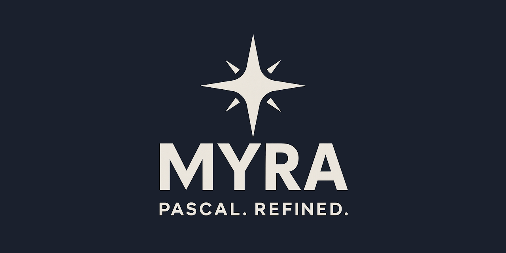

<div align="center">



[](https://discord.gg/Wb6z8Wam7p) [](https://bsky.app/profile/tinybiggames.com)

</div>

## What is Myra?

**Myra is C++23. You just write it in Pascal syntax.**

Under the hood, Myra compiles to C++ 23 and uses [Zig](https://ziglang.org/) as the build system. That means you get everything C++ 23 gives you: the full standard library, every platform target Zig/clang supports, every optimization the compiler can produce, without writing a line of C++. You write clean, structured Pascal-style code. Myra handles the rest.

```myra
module exe hello;

begin
  writeln("Hello from Myra! 🚀");
end.
```

When you need C++, you just write it. `#include` a header, declare a C++ variable, call a C++ function, use `new`/`delete`, `static_cast`, `std::vector`, whatever you need. Myra and C++ coexist in the same source file with no wrappers, no bindings, no escape hatches. If the compiler does not recognise a token as Myra, it treats it as C++ and passes it through verbatim. The standard library itself is written this way.

Myra takes its syntax philosophy from Oberon: start with Pascal and remove everything that is not essential. What remains is clean, readable, and unambiguous. `begin..end` blocks, `:=` assignment, strong static typing, and a module system that replaces header files entirely. No cruft, no legacy baggage. Just the parts of Pascal that were always right.

The entire toolchain ships in the box. Zig, clang, the C++ runtime, the standard library, the LSP server, the debugger adapter: everything needed to go from source to native binary is included in the release. There is nothing to install, configure, or set up. You unzip, add `bin\` to your PATH, and write code.

## 🎯 Who is Myra For?

Myra is for developers who want native performance and low-level control without fighting the language. If you are building any of the following, Myra is worth a look:

- **Systems software**: Write low-level code with full pointer arithmetic, packed structs, overlay types, and direct memory management. Myra does not hide the machine from you.
- **Game engines and tools**: Call C libraries (SDL3, raylib, etc.) directly via FFI with no boilerplate. Target Windows and Linux from the same codebase. Shared library interop is a first-class feature, not an afterthought.
- **DLL / shared library development**: Export clean C-linkage APIs from a Myra `dll` or `lib` module and consume them from any language that speaks C ABI.
- **Cross-platform CLI tools**: Compile once, run on Windows and Linux64. WSL2 integration means you can build and test Linux binaries without leaving Windows.
- **Embedded tooling**: Small, predictable binaries with configurable optimization levels (`releasesmall`, `releasefast`, `releasesafe`). The Zig backend produces tight output.
- **Learning systems programming**: Pascal-family syntax is famously readable and explicit. Myra adds modern ideas while keeping the code approachable for people coming from high-level languages.

## ✨ Key Features

Myra is a complete language for systems-level development. These are the capabilities that ship today:

- 🔧 **Pascal-family syntax**: Clean, readable, case-insensitive. `begin..end` blocks, `:=` assignment, strong typing throughout. Familiar to Pascal and Delphi developers; readable even to those who are not.
- 🎯 **Native binaries**: Compiles to real x86-64 executables, DLLs, and static libraries. No VM, no bytecode, no interpreter. The output runs bare metal.
- 🌐 **Cross-platform**: Target Windows (Win64) or Linux (Linux64) from the same source. Cross-compile from Windows via WSL2 with no additional configuration.
- 🔗 **FFI / C interop**: Call any C library with `external` declarations and `"C"` linkage. Full varargs support for `printf`-style APIs. Perfect ABI compatibility — structs, unions, anonymous overlays, and bit fields map directly to their C equivalents with no manual adjustment.
- 🔄 **Seamless C++ interop**: Every Myra source file can freely use C++ `#include` directives, C++ types (`std::string`, `std::vector`), C++ function calls, C++ casts, and C++ `new`/`delete` directly alongside Myra code. No bindings, no importer, no boilerplate. Myra inherits automatic C++ passthrough from Metamorf.
- 📦 **Module system**: Three module kinds: `exe` (executable), `dll` (shared library), `lib` (static library). A clean `import` mechanism wires them together without header files.
- 🧬 **Rich type system**: Records with inheritance and field alignment, objects with methods and virtual dispatch, overlays, choices, sets, fixed and dynamic arrays, typed and untyped pointers, routine types, and bit fields.
- ⚠️ **Structured exception handling**: `guard/except/finally` with full hardware exception support for divide-by-zero, access violations, and other CPU-level faults.
- 🔄 **Routine overloading**: Multiple routines with the same name resolved by parameter signature. The C++ backend handles name mangling transparently.
- 📊 **Sets**: Pascal-style bit-set types backed by a 64-bit integer. Full set arithmetic: membership (`in`), union (`+`), intersection (`*`), and difference (`-`).
- 📝 **Managed strings**: Reference-counted UTF-8 `string` and UTF-16 `wstring` types with automatic lifecycle management. Emoji, CJK, and accented characters work without any special handling.
- 💾 **Full memory control**: `create`/`destroy` for object instances, `getMem`/`freeMem` for raw allocation, `resizeMem` for reallocation. You decide what lives where.
- 🔢 **Variadic routines**: Define your own variadic routines with `...`. Access argument count and values via `varargs.count` and `varargs.next(T)`.
- 🏷️ **Version info and icons**: Embed metadata and application icons into Windows executables via directives. No post-build steps or resource compilers required.
- 🔀 **Conditional compilation**: `@ifdef`/`@ifndef`/`@elseif`/`@else`/`@endif` with predefined platform symbols. Write platform-specific code in the same file cleanly.
- 🛠️ **Baked CLI**: The `myra` command is a standalone compiler built with Metamorf's bake feature. Compile, run, and debug Myra programs with a single command. No Makefiles, no CMake, no build configuration required.
- 🐛 **Integrated debugger**: DAP-compatible debugger integration via LLDB with the `-d` flag. The `@breakpoint` directive marks source locations automatically.
- ✅ **Built-in test blocks**: `test "name" begin ... end;` blocks for inline unit tests, compiled and run as part of the test suite with colour-coded pass/fail output.

## 🚀 Getting Started

Every Myra program is a **module**. The module kind (`exe`, `dll`, or `lib`) is declared at the top of the file and determines what artifact gets built. An executable module has a `begin..end.` body that serves as the program entry point. There is no `main()` to wire up, no boilerplate to write.

Here is a complete program that demonstrates cross-platform conditional compilation and the `writeln` format string syntax:

```myra
module exe hello;

//@target win64
//@target linux64

begin
  @ifdef TARGET_WIN64
  writeln("Hello from Myra, running on WIN64");
  @elseif TARGET_LINUX64
  writeln("Hello from Myra, running on LINUX64");
  @else
  writeln("Hello from Myra, running on UNKNOWN");
  @endif

  writeln("Name: {}, Age: {}", "Jarrod", 42);
  writeln("Pi is approximately {:.4f}", 3.14159);
  writeln("Hex: 0x{:X}, Octal: {:o}", 255, 255);

  writeln("Hello 🌍 World!");
end.
```

The `writeln` statement accepts a format string with `{}` placeholders that are matched left-to-right to the arguments that follow. Standard format specifiers are supported inside the braces: `{:.4f}` for fixed-point precision, `{:X}` for uppercase hex, `{:o}` for octal, and more. The `write` statement works identically but does not append a newline.

The `@target` directive (commented out above) lets you lock a source file to a specific platform. When left commented, the compiler target is controlled at the command line or from the build configuration. The `TARGET_WIN64` and `TARGET_LINUX64` symbols are injected automatically based on the active target, so you can write portable code that branches cleanly at compile time.

## 📖 Language Tour

### Routines

Routines are the basic unit of abstraction in Myra. They are declared with the `routine` keyword and can return a value using `return`. Parameters are passed by value (as `const`) by default. Use `var` to pass by reference when you need the routine to modify the caller's variable. Routines can be overloaded, meaning multiple routines can share the same name as long as their parameter signatures differ.

Local `type`, `const`, and `var` sections can appear inside a routine body before the `begin` block, keeping definitions scoped to where they are needed.

```myra
module exe routines;

routine add(const a: int32; const b: int32): int32;
begin
  return a + b;
end;

// Routine overloading - same name, different types
routine max(const a: int32; const b: int32): int32;
begin
  if a > b then return a; end;
  return b;
end;

routine max(const a: float64; const b: float64): float64;
begin
  if a > b then return a; end;
  return b;
end;

// Recursion
routine fib(const n: int32): int32;
begin
  if n <= 1 then return n; end;
  return fib(n - 1) + fib(n - 2);
end;

// var parameter - modified in place
routine inc(var x: int32);
begin
  x := x + 1;
end;

var
  x: int32;

begin
  writeln("add(3, 4) = {}", add(3, 4));
  writeln("max int = {}", max(3, 7));
  writeln("max float = {}", max(3.5, 2.8));
  writeln("fib(10) = {}", fib(10));

  x := 10;
  inc(x);
  writeln("after inc: x = {}", x);
end.
```

### Records

Records are value types. They live on the stack (or inline in their containing structure) and are copied on assignment. Myra gives you full control over memory layout: you can pack a record to remove padding, specify an explicit alignment for SIMD or DMA use cases, define individual fields as bit fields with a `: width` specifier, and derive one record from another to inherit its fields.

Record literal syntax (`RecordType{ field: value, ... }`) lets you construct and assign records in a single expression, which is particularly useful for initialising nested structures or passing records to routines.

```myra
module exe records;

type
  // Basic record
  Point = record
    x: int32;
    y: int32;
  end;

  // Packed record - no padding between fields
  PackedRec = record packed
    a: int8;
    b: int8;
    c: int8;
  end;

  // Aligned record - useful for SIMD, DMA buffers, etc.
  Align16Rec = record align(16)
    a: int8;
    b: int8;
  end;

  // Record inheritance - Point3D extends Point
  Point3D = record(Point)
    z: int32;
  end;

  // Bit fields (: width)
  Flags = record
    active: int32 : 1;
    mode:   int32 : 3;
    level:  int32 : 4;
  end;

var
  p: Point;
  p3: Point3D;
  f: Flags;

begin
  // Record literal syntax
  p := Point{ x: 10, y: 20 };
  writeln("Point: {}, {}", p.x, p.y);

  // Inherited fields accessible directly
  p3.x := 100;
  p3.y := 200;
  p3.z := 300;
  writeln("Point3D: {}, {}, {}", p3.x, p3.y, p3.z);

  f.active := 1;
  f.mode   := 7;
  f.level  := 1;
  writeln("Bits: {}, {}, {}", f.mode, f.level, f.active);
end.
```

### Objects

Objects are reference types: they are always heap-allocated and accessed through pointers. They support fields, methods, single-level inheritance, virtual dispatch, and `parent` calls for delegating to an overridden method in the base class. Virtual dispatch happens automatically when you call a method through a base-object pointer, with no explicit vtable management needed.

Objects are allocated with `create` and released with `destroy`. There is no garbage collector; you manage lifetime explicitly. This keeps the memory model predictable and deterministic, which matters in games, embedded tools, and any context where latency spikes are unacceptable.

```myra
module exe classes;

type
  TAnimal = object
    Name_: string;
    Age: int32;

    method Init(AName: string; AAge: int32);
    begin
      Self.Name_ := AName;
      Self.Age   := AAge;
    end;

    method Speak();
    begin
      writeln("Animal {} says: ...", Self.Name_);
    end;

    method Describe();
    begin
      writeln("I am {}, age {}", Self.Name_, Self.Age);
    end;
  end;

  TDog = object(TAnimal)
    Breed: string;

    method Init(AName: string; AAge: int32; ABreed: string);
    begin
      Self.Name_ := AName;
      Self.Age   := AAge;
      Self.Breed := ABreed;
    end;

    // Override - virtual dispatch through base pointer
    method Speak();
    begin
      writeln("Dog {} says: Woof!", Self.Name_);
    end;

    // Override with parent call
    method Describe();
    begin
      parent.Describe();
      writeln("I am a {} breed", Self.Breed);
    end;
  end;

var
  animal: pointer to TAnimal;
  dog: pointer to TDog;
  cat_as_animal: pointer to TAnimal;

begin
  // Allocate on heap
  create(animal);
  animal^.Init("Generic", 5);
  animal^.Speak();

  create(dog);
  dog^.Init("Buddy", 3, "Golden Retriever");
  dog^.Speak();
  dog^.Describe();

  // Virtual dispatch through base pointer
  cat_as_animal := pointer to TAnimal(dog);
  cat_as_animal^.Speak(); // calls TDog.Speak()

  destroy(animal);
  destroy(dog);
end.
```

### Choices and Constants

Constants in Myra are typed and can be formed from constant expressions. Choices define an ordered set of named values. By default the ordinal values start at zero and increment, but you can assign explicit integer values to any member, which is useful when the enum must match a C API or a wire protocol.

Enumeration values support comparison operators (`=`, `<>`, `<`, `>`, etc.) and can be cast to and from integer types for interop purposes.

```myra
module exe enums_consts;

const
  MAX_SIZE   = 100;
  PI         = 3.14159;
  APP_NAME   = "MyApp";
  EXPR_CONST = 10 + 5;

type
  Color    = choices(Red, Green, Blue, Yellow);
  Priority = choices(Low = 0, Medium = 5, High = 10, Critical = 20);

var
  c: Color;
  p: Priority;

begin
  writeln("MAX_SIZE = {}", MAX_SIZE);
  writeln("PI = {}", PI);

  c := Green;
  writeln("c = Green: {}", c = Green);
  writeln("Green > Red: {}", Green > Red);
  writeln("Green < Yellow: {}", Green < Yellow);

  p := Medium;
  writeln("Medium = {}", int32(p));
  writeln("Medium > Low: {}", p > Low);
  writeln("Medium < Critical: {}", p < Critical);
end.
```

### Arrays

Myra supports both fixed-size and dynamic arrays. Fixed arrays have their bounds declared at compile time and live on the stack or inline in their containing record. Dynamic arrays are heap-allocated, reference-counted, and resized with `setLength`. Both kinds are zero-indexed by default, but fixed arrays can declare any integer range as their index bounds.

The `len()` intrinsic returns the number of elements in either kind of array. For dynamic arrays, `setLength` grows or shrinks the allocation while preserving existing elements. Shrinking is safe. Elements beyond the new length are discarded.

```myra
module exe arrays;

type
  IntArr5 = array[0..4] of int32;

var
  // Fixed array - zero-based
  nums: IntArr5;
  // Fixed array - one-based
  oneBased: array[1..3] of int32;
  // Dynamic array
  dyn: array of int32;
  i: int32;

begin
  // Fixed array
  nums[0] := 10; nums[1] := 20; nums[2] := 30;
  nums[3] := 40; nums[4] := 50;
  writeln("Fixed len: {}", len(nums));

  // Dynamic array - setLength allocates/resizes
  setLength(dyn, 3);
  dyn[0] := 10; dyn[1] := 20; dyn[2] := 30;
  writeln("Dyn len: {}", len(dyn));

  // Grow - existing elements preserved
  setLength(dyn, 5);
  writeln("After grow: {} {} {} {} {}", dyn[0], dyn[1], dyn[2], dyn[3], dyn[4]);

  // Shrink
  setLength(dyn, 2);
  writeln("After shrink: {} {}", dyn[0], dyn[1]);
end.
```

### Sets

Pascal-style sets are one of Myra's most expressive features for flag and membership logic. A set is backed by a 64-bit integer where each bit represents the presence or absence of an element. Sets support the full algebra: union (`+`), intersection (`*`), difference (`-`), and membership testing (`in`). This makes them significantly more readable than hand-rolled bitmask operations while compiling down to the same bitwise instructions.

Set literals use square-bracket syntax (`[1, 3, 5]`). Membership tests read naturally: `if 1 in s1 then`.

```myra
module exe sets;

var
  s1: set;
  s2: set;
  s3: set;

begin
  s1 := [1, 3, 5];       // bits 1, 3, 5
  s2 := [3, 5, 10];      // bits 3, 5, 10

  // Union, intersection, difference
  s3 := s1 + s2;         // [1, 3, 5, 10]
  writeln("Union: {}", int64(s3));

  s3 := s1 * s2;         // [3, 5]
  writeln("Intersection: {}", int64(s3));

  s3 := s1 - s2;         // [1]
  writeln("Difference: {}", int64(s3));

  // Membership test
  s1 := [1, 3, 5, 10];
  if 1 in s1 then
    writeln("1 in s1: true");
  end;
  if not (2 in s1) then
    writeln("2 not in s1: true");
  end;
end.
```

### Strings

Myra has two managed string types. `string` stores UTF-8 encoded text and is the default for all general-purpose string work. `wstring` stores UTF-16 encoded text and is useful when interfacing with Windows APIs that require wide strings. Both types are reference-counted and freed automatically. There is no `StrNew`/`StrDispose` dance, no null terminator to manage by hand.

String literals can contain any Unicode codepoint directly in source: accents, CJK characters, emoji, whatever your editor can represent. The `utf8()` intrinsic converts a `wstring` to `string` so it can be passed to `writeln` or any routine that expects UTF-8.

Raw string literals are prefixed with `@"` and treat everything literally. No escape sequences are processed inside them, making them ideal for regular expressions, Windows paths, and any text that would otherwise need heavy escaping. Wide string literals are prefixed with `w"`.

```myra
module exe strings;

var
  s:  string;
  ws: wstring;

begin
  s := "Hello, Myra!";
  writeln("Basic: {}", s);

  // UTF-8: accents, CJK, emoji all work natively
  s := "Héllo Wörld! 你好 🎉";
  writeln("UTF-8: {}", s);

  // Raw string - no escape processing
  s := @"C:\Users\Dev\no\escaping\needed";
  writeln("Raw: {}", s);

  // wstring - UTF-16
  ws := w"Wide Hello!";
  writeln("WString: {}", utf8(ws));

  ws := w"Héllo Wörld! 你好 🎉";
  writeln("Wide UTF-16: {}", utf8(ws));
end.
```

### Control Flow

Myra provides the full set of structured control flow constructs you would expect from a Pascal-family language. `for..to` and `for..downto` handle counted iteration. `while..do` tests before the loop body. `repeat..until` tests after. `match` dispatches on an ordinal value with support for single values, comma-separated value lists, and inclusive ranges, all in the same statement.

Every block is closed with `end`, making nesting unambiguous without relying on indentation rules or brace counting.

```myra
module exe control;

var
  i: int32;
  x: int32;

begin
  // for..to and for..downto
  for i := 0 to 4 do
    write(" {}", i);
  end;
  writeln("");

  for i := 5 downto 1 do
    write(" {}", i);
  end;
  writeln("");

  // repeat..until
  i := 0;
  repeat
    i := i + 1;
  until i = 5;
  writeln("repeat ended at: {}", i);

  // while..do
  i := 10;
  while i > 0 do
    i := i - 3;
  end;
  writeln("while ended at: {}", i);

  // match with single values, comma lists, and ranges
  x := 5;
  match x of
    1:       writeln("one");
    2, 3:    writeln("two or three");
    4..6:    writeln("four to six");
  else
    writeln("other");
  end;
end.
```

### Exceptions

Myra uses `guard/except/finally` for structured error handling. The `except` block runs if an exception is raised inside the `guard` block. The `finally` block always runs, whether an exception occurred or not, making it the right place to release resources. Both blocks can appear together in a single `guard` statement.

Hardware exceptions raised by the CPU (divide-by-zero, null pointer dereference, illegal instruction) are caught by the same mechanism. The `getExceptionCode()` and `getExceptionMessage()` intrinsics retrieve details about the active exception from within an `except` block. Use `raiseException()` to raise a software exception with a message, or `raiseExceptionCode()` to raise one with both a code and a message.

```myra
module exe exceptions;

routine getZero(): int32;
begin
  return 0;
end;

begin
  // Basic guard/except
  guard
    raiseException("Test error");
  except
    writeln("Caught: code={}, msg={}", getExceptionCode(), getExceptionMessage());
  end;

  // guard/except/finally
  guard
    raiseExceptionCode(42, "Custom error");
  except
    writeln("Except: code={}", getExceptionCode());
  finally
    writeln("Finally always runs");
  end;

  // Hardware exception - divide by zero
  guard
    writeln("Result: {}", 10 div getZero());
  except
    writeln("Hardware exception caught: {}", getExceptionMessage());
  end;
end.
```

### Memory Management

Myra gives you two levels of memory control depending on what you are building. For object instances, use `create` to allocate on the heap and `destroy` to release. For raw blocks of memory such as buffers, C-style arrays, and interop structures, use `getMem` to allocate, `freeMem` to release, and `resizeMem` to grow or shrink an existing allocation while preserving its contents.

Typed pointers (`pointer to T`) support the address-of operator (`address of`), dereference (`^`), and pointer arithmetic. You can cast between pointer types with an explicit cast expression. This gives you the same memory-level access you would have in C, with the same explicitness that makes the code easy to audit.

```myra
module exe memory;

var
  p:  pointer;
  pb: pointer to int8;
  x:  int32;
  px: pointer to int32;

begin
  // Raw allocation
  p := getMem(100);

  pb := pointer to int8(p);
  pb^ := 42;
  writeln("Value at offset 0: {}", pb^);

  pb := pointer to int8(p) + 50;
  pb^ := 99;
  writeln("Value at offset 50: {}", pb^);

  // Grow - preserves existing data
  p := resizeMem(p, 200);
  pb := pointer to int8(p);
  writeln("Preserved offset 0: {}", pb^);

  freeMem(p);

  // Typed pointer and address-of
  x := 42;
  px := address of x;
  writeln("Via pointer: {}", px^);
  px^ := 100;
  writeln("x is now: {}", x);
end.
```

### Pointers and Overlays

Named pointer types let you give a typed pointer an alias, which improves readability and makes complex declarations easier to work with. Overlays declare a set of fields that all share the same memory region. Reading through one field and writing through another is a well-defined operation in Myra, matching C union semantics exactly.

Overlays can be standalone types or embedded anonymously inside a record. The anonymous overlay form is the idiomatic way to represent a tagged variant type where a tag field discriminates between interpretations of the shared payload.

```myra
module exe pointers_unions;

type
  // Named pointer type
  PInt32 = pointer to int32;

  // Standalone overlay - all fields share memory
  IntOrFloat = overlay
    i: int32;
    f: float32;
  end;

  // Record with anonymous overlay inside (tagged variant)
  Variant = record
    tag: int32;
    overlay
      asInt:   int32;
      asFloat: float32;
    end;
  end;

var
  p: PInt32;
  x: int32;
  u: IntOrFloat;
  v: Variant;

begin
  x := 12345;
  p := address of x;
  writeln("Via PInt32: {}", p^);

  // Write int, read back as float bits
  u.i := 0x3F800000;  // IEEE 754 for 1.0
  writeln("Union float: {}", u.f);

  // Tagged variant
  v.tag := 1;
  v.asInt := 99;
  writeln("Variant int: {}", v.asInt);
end.
```

### Variadic Routines

User-defined variadic routines accept a variable number of arguments. Declare the variadic parameter with `...` and use `varargs.count` to get the argument count and `varargs.next(T)` to retrieve each argument in order. Type safety is the caller's responsibility. `varargs.next(T)` reinterprets the next slot as type `T`, matching the semantics of C's `va_arg`.

`varargs.copy()` returns a snapshot of the current argument cursor, enabling multi-pass iteration over the same argument list, useful when you need to scan arguments twice: once to count, once to process.

```myra
module exe variadic;

routine sumInts(...): int32;
var
  i:   int32;
  sum: int32;
  arg: int32;
begin
  sum := 0;
  for i := 0 to varargs.count - 1 do
    arg := varargs.next(int32);
    sum := sum + arg;
  end;
  return sum;
end;

routine printAll(const prefix: string; ...);
var
  i: int32;
begin
  for i := 0 to varargs.count - 1 do
    writeln("{}: {}", prefix, varargs.next(int32));
  end;
end;

begin
  writeln("sumInts(10, 20, 30) = {}", sumInts(10, 20, 30));
  writeln("sumInts(1, 2, 3, 4, 5) = {}", sumInts(1, 2, 3, 4, 5));
  writeln("sumInts() = {}", sumInts());
  printAll("item", 100, 200, 300);
end.
```

### Module System

Myra's module system maps one source file to one output artifact. The module kind is declared on the first line of the file. There are three kinds: `exe` for executables, `dll` for shared libraries, and `lib` for static libraries. This explicit declaration means the build system always knows what to produce without external configuration files for the common case.

Symbols are module-private by default. Use the `exported` keyword to export a symbol from a `lib` or `dll` module.

#### Executable (`exe`)

An executable module has a `begin..end.` body that serves as the entry point:

```myra
module exe myprogram;

begin
  writeln("Hello!");
end.
```

#### Static Library (`lib`)

A static library is compiled to `.lib` on Windows and `.a` on Linux. Import it into another module with the `import` statement. Only symbols marked `exported` are visible to importers.

```myra
module lib math;

// Private helper - not exported
routine dbl(const x: int32): int32;
begin
  return x + x;
end;

// Exported - visible to importers
exported routine "C" add(const a: int32; const b: int32): int32;
begin
  return a + b;
end;

exported routine "C" quadruple(const x: int32): int32;
begin
  return dbl(dbl(x));
end;

end.
```

#### Shared Library (`dll`)

A shared library is compiled to `.dll` on Windows and `.so` on Linux. Export symbols with `exported`. External callers use the C ABI when the routine is declared with `"C"` linkage.

```myra
module dll mylib;

exported routine "C" add(const a: int32; const b: int32): int32;
begin
  return a + b;
end;

exported var version: int32 = 1;

end.
```

#### Importing Modules

Use `import` to bring a `lib` module into scope. Imported symbols are accessed through the module name as a namespace qualifier:

```myra
module exe myapp;

import math;

begin
  writeln("{}", math.add(3, 5));
  writeln("{}", math.quadruple(5));
end.
```

### FFI: Calling C Libraries

Myra's FFI story is straightforward: declare the function signature, name the library, and call it. Use the `external` keyword to declare a C function that lives in a DLL or shared object. Use `"C"` linkage to tell the compiler to emit an unmangled symbol name, which is what virtually every C library expects. Varargs (`...`) are fully supported for `printf`-style functions.

The optional `name "alias"` form lets you map a Myra identifier to a differently-named export, which is useful when the C symbol name conflicts with a Myra keyword or contains characters that are not valid in identifiers.

```myra
module exe ffi_demo;

// Declare an external C function
routine "C" printf(const fmt: pointer to char; ...): int32;
external "msvcrt.dll";

// External with name alias
routine "C" myFunc(): int32;
external "mylib.dll" name "my_actual_export";

// External variable
var gCounter: int32;
gCounter: external "mylib.dll";
```

Use `@linkLibrary` to tell the build system which library to link, and `@libraryPath` to add a directory to the linker search path:

```myra
module exe uselib;

@linkLibrary "mylib.lib"
@libraryPath "libs/"
```

Use `@copyDll` to copy a shared library to the output directory at build time, so the executable can find it at runtime:

```myra
@copyDll "libs/mylib.dll"
```

### Mixed Mode: Seamless C++ Interop

Myra is built on Metamorf, which provides automatic C++ passthrough as an inherited capability. Every Myra source file can freely intermix Myra code and C++ code without any special configuration, bindings, or import tooling. The rule is simple: if it is not a Myra keyword, it is C++, and it passes through verbatim to the generated output.

This means you can `#include` any C or C++ header, use C++ types as Myra variable types, call C++ functions directly in Myra expressions, and use C++ `new`/`delete` alongside Myra's own `create`/`destroy`. The compiler resolves the boundary automatically. Myra keywords always take priority; everything else is collected and emitted as C++.

#### Including C++ Headers

Place `#include` directives at the top of your module, after the `module` declaration. They pass through directly to the generated C++ output:

```myra
module exe mixedmode;

#include <cmath>
#include <cstring>
#include <string>
#include <vector>

begin
  writeln("abs(-42) = {}", std::abs(-42));
  writeln("strlen = {}", int32(strlen("hello")));
end.
```

No `external` declaration, no FFI boilerplate, no generated bindings. The `#include` makes the C++ declarations available and you call them directly.

#### C++ Types as Myra Variables

C++ types work as Myra variable types. You can declare variables of any C++ type, call methods on them, and pass them to C++ functions:

```myra
var
  LS: std::string;
  LVec: std::vector<int32_t>*;

begin
  LS := "hello world";
  writeln("length = {}", LS.length());
  writeln("substr = {}", LS.substr(0, 5));

  if not (LS.empty()) then
    writeln("not empty");
  end;

  LS.clear();
end.
```

C++ method calls, indexing, and member access all work naturally inside Myra expressions and control flow. The Myra compiler does not analyse C++ types or methods; it collects them and lets Clang handle type checking.

#### C++ Functions in Myra Expressions

C++ function calls work anywhere a Myra expression is expected, including inside `if` conditions, `for` bounds, `writeln` arguments, and assignment right-hand sides:

```myra
var
  LX: int32;
  LD: float64;

begin
  LX := std::max(10, 20);
  LD := std::sqrt(16.0) * 2.0;

  // C++ function results in Myra control flow
  for LI := std::abs(-3) downto 0 do
    write("{} ", LI);
  end;
end.
```

#### C++ `new`/`delete` Alongside Myra `create`/`destroy`

Myra uses `create`/`destroy` for its own object instances. C++ `new`/`delete` passes through for C++ types:

```myra
var
  LPStr: std::string*;
  LPVec: std::vector<int32_t>*;

begin
  // C++ new/delete - passthrough
  LPStr := new std::string("hello from C++");
  writeln("{}", *LPStr);
  delete LPStr;

  LPVec := new std::vector<int32_t>();
  LPVec->push_back(1);
  LPVec->push_back(2);
  writeln("size={}, first={}", LPVec->size(), (*LPVec)[0]);
  delete LPVec;
end.
```

#### C++ Casts and Namespaces

C-style casts, `static_cast`, `reinterpret_cast`, and C++ namespace-qualified names all pass through:

```myra
var
  LD: float64;
  LX: int32;
  LPVoid: pointer;
  LPInt: int32_t*;
  LSeekDir: std::ios_base::seekdir;

begin
  // static_cast
  LD := 42.7;
  LX := static_cast<int32_t>(LD);

  // reinterpret_cast
  LPVoid := address of LX;
  LPInt := reinterpret_cast<int32_t*>(LPVoid);

  // C++ namespaces (even when they contain Myra keywords like 'end' or 'in')
  LSeekDir := std::ios::end;
end.
```

Myra keywords inside C++ namespace-qualified names (like `std::ios::end` or `std::ios::in`) are handled correctly. The `::` scope operator signals C++ context, so the keyword is treated as a C++ identifier rather than a Myra keyword.

#### How It Works

The passthrough is a Metamorf platform feature, not a Myra-specific mechanism. After Myra's `.mor` grammar is loaded, Metamorf automatically registers all 62 C++ keywords (only for those not already claimed by Myra), C++ operators (`::`, `->`, `++`, `--`, `<<`, `>>`, etc.), and C++ delimiters (`{`, `}`). Grammar handlers collect C++ constructs using brace-depth tracking and emit them verbatim. Expression-level rules handle C-style casts, pointer dereferences (`*ptr`), and address-of (`&expr`) as native AST nodes.

Because Myra deliberately avoids colliding with any C++ keyword (using `object` instead of `class`, `choices` instead of `enum`, `overlay` instead of `union`, `guard` instead of `try`, etc.), the lexer can unambiguously assign every token to either the Myra or C++ family with zero context needed. This is what makes the seamless interop possible.

### Directives and Conditional Compilation

Directives begin with `@` and are processed at compile time. They control which code gets compiled, what the compiler emits, and how the build system links the output. Directives are not preprocessor macros. They are part of the language grammar and interact cleanly with the rest of the compiler pipeline.

The conditional compilation directives (`@ifdef`, `@ifndef`, `@elseif`, `@else`, `@endif`) let you include or exclude code based on defined symbols. This is the idiomatic way to write platform-specific code in Myra without splitting it across separate files.

```myra
module exe conditional;

// Define your own symbols
@define DEBUG

@ifdef DEBUG
  @message hint "Debug build active"
@endif

// Target-specific declarations
@ifdef TARGET_WIN64
routine "C" Sleep(const ms: uint32);
external "kernel32.dll";
@endif

@ifdef TARGET_LINUX64
routine "C" usleep(const us: uint32): int32;
external "libc.so.6";
@endif

begin
  @ifdef DEBUG
  writeln("Running in DEBUG mode");
  @endif

  @ifdef TARGET_WIN64
  Sleep(0);
  @endif
end.
```

**Predefined symbols** (automatically set by the compiler based on `@target`):

| Symbol | When defined |
|--------|--------------|
| `MYRA` | Always |
| `TARGET_WIN64` | `@target win64` |
| `WIN64`, `MSWINDOWS`, `WINDOWS` | `@target win64` |
| `TARGET_LINUX64` | `@target linux64` |
| `LINUX`, `POSIX`, `UNIX` | `@target linux64` |
| `CPUX64` | `win64` or `linux64` |
| `CONSOLE_APP` | `@subsystem console` (default) |
| `GUI_APP` | `@subsystem gui` |

**Full directive reference:**

| Directive | Description |
|-----------|-------------|
| `@subsystem type` | `console` (default) or `gui`, controls whether the executable has a console window |
| `@target platform` | Set target: `win64`, `linux64` |
| `@optimize level` | `debug`, `releasesafe`, `releasefast`, `releasesmall` |
| `@define name` | Define a conditional symbol |
| `@undef name` | Undefine a symbol |
| `@ifdef name` | Compile if symbol defined |
| `@ifndef name` | Compile if symbol not defined |
| `@elseif name` | Else-if branch |
| `@else` | Else branch |
| `@endif` | Close conditional |
| `@message level "text"` | Emit `hint`/`warn`/`error`/`fatal` at parse time |
| `@breakpoint` | Record DAP debugger breakpoint location |
| `@linkLibrary "path"` | Link a library |
| `@libraryPath "path"` | Add linker search path |
| `@modulePath "path"` | Add module search path |
| `@copyDll "path"` | Copy DLL to output directory |
| `@exeIcon "path"` | Embed icon in Windows EXE |
| `@addVerInfo` | Enable version info embedding |
| `@viMajor`, `@viMinor`, `@viPatch` | Version number fields |
| `@viProductName`, `@viDescription` | Version info strings |
| `@viFilename`, `@viCompanyName`, `@viCopyright` | Version info strings |
| `@unitTestMode on\|off` | Toggle unit test mode in emitter |

### Intrinsics

Intrinsics are built-in operations that look and feel like routine calls but are handled directly by the compiler. They have no overhead and cannot be reimplemented in user code. Use them whenever you need a capability that requires compiler cooperation, such as querying the length of an array, getting the size of a type, or retrieving exception information from inside a handler.

| Intrinsic | Description |
|-----------|-------------|
| `len(expr)` | Number of elements in an array or characters in a string |
| `size(T)` or `size(expr)` | Size in bytes of a type or expression |
| `utf8(wstr)` | Convert a `wstring` to `string` |
| `getMem(size)` | Allocate `size` bytes on the heap |
| `resizeMem(ptr, size)` | Resize a heap allocation, preserving contents |
| `paramCount()` | Number of command-line arguments passed to the program |
| `paramStr(n)` | The Nth command-line argument as a string |
| `getExceptionCode()` | Integer code of the active exception (use inside `except`) |
| `getExceptionMessage()` | Message string of the active exception (use inside `except`) |

### Built-in Test Blocks

Myra has first-class support for unit tests baked into the language. `test` blocks are appended after the module's closing `end.` and are part of the source file but are only compiled and executed when the test runner invokes the module in test mode. Each test block has a name string that appears in the test output, making failures easy to locate.

Tests can have their own `var` section for local state. The test assertion intrinsics handle failure signalling and reporting automatically. All tests are independent. A failure in one does not abort the suite.

**Test assertion intrinsics:**

| Intrinsic | Description |
|-----------|-------------|
| `testAssertEqualInt(expected, actual)` | Fail if two integer values are not equal |
| `testAssertEqualBool(expected, actual)` | Fail if two boolean values are not equal |
| `testAssertTrue(expr)` | Fail if expression is not true |
| `testAssertFalse(expr)` | Fail if expression is not false |
| `testAssertNil(ptr)` | Fail if pointer is not nil |

When an assertion fails, the test runner reports which assertion failed, the file and line number, and the expected vs actual values. Execution continues with the next test.

```myra
module exe math_module;

@unitTestMode on

routine add(const a: int32; const b: int32): int32;
begin
  return a + b;
end;

routine isPositive(const a: int32): boolean;
begin
  return a > 0;
end;

begin
  // main program body
end.

test "addition"
begin
  testAssertEqualInt(5, add(2, 3));
  testAssertEqualInt(0, add(-1, 1));
end;

test "boolean checks"
begin
  testAssertTrue(isPositive(5));
  testAssertFalse(isPositive(-5));
  testAssertEqualBool(true, isPositive(1));
end;

test "pointer check"
var
  p: pointer;
begin
  p := nil;
  testAssertNil(p);
end;
```

The `@unitTestMode on` directive tells the emitter to include the test framework scaffolding. The test runner prints a summary showing pass/fail counts and highlights any failed assertions with the source location.

## 🛠️ The `myra` CLI

The `myra` command is a baked Metamorf compiler. It was created using Metamorf's **bake** feature, which packages a `.mor` language definition into a standalone compiler executable. End users get a single `myra.exe` that compiles Myra source to native binaries without needing Metamorf, `mor.exe`, or any `.mor` files.

### How `myra.exe` Is Built

The Myra language is defined in a set of `.mor` files (`myra.mor`, `myra_tokens.mor`, `myra_grammar.mor`, `myra_semantics.mor`, `myra_emitters.mor`, `myra_helpers.mor`). The main file `myra.mor` imports the others. Baking parses all of them, validates the complete AST, serializes it as a binary resource, and embeds it into a copy of `mor.exe` with custom branding:

```bash
mor --bake myra.mor -o myra.exe --product "Myra" --company "tinyBigGAMES LLC" --version 0.1.0 --icon myra.ico --url "https://metamorf.dev" --copyright "Copyright 2025 tinyBigGAMES LLC"
```

At runtime, `myra.exe` deserializes the embedded AST, rebuilds the compiler dispatch tables, and compiles user source through the normal Metamorf pipeline: lex, parse, semantic analysis, C++23 code generation, and native build via Zig/Clang.

The Zig/Clang toolchain is required at compile time for native code generation. The baked exe does not embed the toolchain.

### Usage

```bash
myra -s <source.myra> [options]
```

| Flag | Description |
|------|-------------|
| `-s <file>` | Source file to compile |
| `-o <dir>` | Output directory (default: current directory) |
| `-r` | Compile and run the resulting executable |
| `-d` | Compile and launch the debugger |
| `-h` | Show help |

### Examples

```bash
myra -s hello.myra              # compile
myra -s hello.myra -o build     # compile to specific output directory
myra -s hello.myra -r           # compile and run
myra -s hello.myra -d           # compile and launch debugger
myra -h                         # show help
```

## 🐛 Debugger

Myra includes DAP-compatible debugger integration via LLDB. Use the `-d` flag to compile and launch an interactive debug REPL:

```bash
myra -s myprogram.myra -d
```

The `@breakpoint` directive in your source marks debugger stop locations. After compiling, a `.breakpoints` file is generated that the debugger loads automatically.

The debug REPL supports standard commands: `c` (continue), `n` (step over), `s` (step into), `finish` (step out), `bt` (call stack), `locals` (local variables), `p <expr>` (evaluate), `b <file>:<line>` (set breakpoint), and more.

For the full debugger command reference, programmatic API, and architecture details, see the Debugger section in the [Metamorf documentation](Metamorf.md).


## 🐧 Cross-Platform Development

Myra supports Windows (Win64) and Linux (Linux64) targets from a single codebase. The core language is identical on both platforms. Only the names of external libraries differ when you are calling OS APIs. Shared library names change (`kernel32.dll` vs `libc.so.6`), but all your application logic, data structures, algorithms, and module organisation stay the same.

Cross-compilation from Windows to Linux64 is a first-class workflow. When you target `linux64`, Myra uses Zig as the cross-compiler backend to produce a Linux ELF binary without requiring a Linux toolchain on the host. If WSL2 is installed, Myra automatically runs the resulting binary through WSL to execute it.

### Setting the Target

```myra
// In the source file:
@target win64
// or
@target linux64
```

You can also override the target at the command line without modifying the source. The compiler injects the appropriate `TARGET_*` and platform alias symbols automatically based on the active target.

### WSL Setup (One Time)

To build and run Linux binaries from a Windows host, install WSL2 with Ubuntu:

```powershell
wsl --install -d Ubuntu
```

Then inside WSL, install the base build tools (needed for standard C runtime linking):

```bash
sudo apt update && sudo apt install build-essential
```

That is the full setup. Myra handles the rest: locating WSL, invoking the binary, and routing stdout/stderr back to your terminal.

### Target Platforms

| Target | Status |
|--------|--------|
| Windows x64 (`win64`) | ✅ Supported |
| Linux x64 (`linux64`) | ✅ Supported (native; via WSL on Windows) |


## Formal Grammar (BNF)

### Syntax Notation

EBNF notation is used. Brackets `[` and `]` denote optionality. Braces `{` and `}` denote repetition (zero or more). Parentheses `(` and `)` group alternatives. The vertical bar `|` separates alternatives. Terminal symbols are enclosed in quotes or written in lowercase. Non-terminals are written in PascalCase.

> **Design Principle:** Myra is a Pascal/Oberon-inspired systems programming language
> that compiles to C++ 23 via Metamorf. All languages built with Metamorf inherit
> seamless C++ passthrough: C++ keywords, operators, preprocessor directives, and
> block constructs pass through to the C++ backend unmodified. To keep the lexer's
> token assignment unambiguous, **no Myra keyword collides with any C++ keyword.**
> Clang (via Zig) handles all C++ validation.


### 1. Lexical Elements

```
letter     = "A" | ... | "Z" | "a" | ... | "z" | "_" .
digit      = "0" | ... | "9" .
hexDigit   = digit | "A" | ... | "F" | "a" | ... | "f" .
character  = (* any source character except the delimiter *) .
newline    = (* line feed (U+000A) *) .

ident      = letter { letter | digit } .
integer    = digit { digit } | "0" ( "x" | "X" ) hexDigit { hexDigit } .
float_literal = digit { digit } "." { digit } [ exponent ] [ "f" | "F" ] .
exponent      = ( "e" | "E" ) [ "+" | "-" ] digit { digit } .
cstring    = '"' { character | escapeSeq } '"' .
wstring    = "w" '"' { character | escapeSeq } '"' .
escapeSeq  = "\" ( "n" | "t" | "r" | "0" | "\" | "'" | '"' | "x" hexDigit hexDigit ) .
```

#### Numeric Literal Type Rules

| Literal         | Suffix | Type      | C++ Emit  | Example         |
|----------------|--------|-----------|-----------|-----------------|
| `42`           | -      | `int32`   | `42`      | integer         |
| `1.5`          | -      | contextual| see below | float_literal   |
| `1.5f`, `1.5F` | f/F    | `float32` | `1.5f`    | explicit float32|

**Float literal resolution (no suffix):**
- If assigned to a `float32` variable or passed to a `float32` parameter: `float32`, emits `1.5f`
- If assigned to a `float64` variable or passed to a `float64` parameter: `float64`, emits `1.5`
- If context is ambiguous or unknown: `float64` (safe default, wider type)

**Float literal resolution (f/F suffix):**
- Always `float32` regardless of context, emits with `f` suffix

#### String Literal Convention

- `"..."` -- C-string literal (`const char*`). Escape sequences processed. Used for C++ interop.
- `w"..."` -- Wide-string literal (`std::wstring`). Escape sequences processed. Prefix is case-sensitive: only lowercase `w`.


### 2. Reserved Words

The language is **case-sensitive** for keywords and identifiers.

```
address    align      and        array      begin      choices
const      create     destroy    div        do         downto
else       end        except     exported   external   false
finally    for        freeMem    getExceptionCode
getExceptionMessage   getMem     guard      if         import
in         is         len        match      method     mod        module
nil        not        object     of         or         overlay
packed     paramCount paramStr   parent     pointer
raiseException        raiseExceptionCode    record     repeat
resizeMem  return     routine    self       set        setLength
shl        shr        size       test       then       to         true
testAssert            testAssertTrue        testAssertFalse
testAssertEqualInt    testAssertEqualUInt   testAssertEqualFloat
testAssertEqualStr    testAssertEqualBool   testAssertEqualPtr
testAssertNil         testAssertNotNil      testFail
type       until      utf8       var        varargs    while
write      writeln    xor
```

> **Note:** The identifiers `exe`, `dll`, and `lib` are contextual -- they have special
> meaning only in the `ModuleKind` position and may be used as ordinary identifiers
> elsewhere.

> **Design Note:** Every C++ keyword (`class`, `enum`, `struct`, `union`, `switch`,
> `template`, etc.) is deliberately avoided so the lexer can unambiguously assign every
> token to either the Myra or C++ family with zero context needed. Where C++ has a
> keyword, Myra uses an alternative: `object` instead of `class`, `choices` instead of
> `enum`, `overlay` instead of `union`, `match` instead of `switch`, `size` instead of
> `sizeof`.


### 3. Built-in Types

```
int8       int16      int32      int64
uint8      uint16     uint32     uint64
float32    float64
boolean
char       wchar
string     wstring
pointer
```

#### Type Mapping to C++23

| Myra Type | C++ Type       |
|-------------|----------------|
| `string`    | `std::string`  |
| `wstring`   | `std::wstring` |
| `int8`      | `int8_t`       |
| `int16`     | `int16_t`      |
| `int32`     | `int32_t`      |
| `int64`     | `int64_t`      |
| `uint8`     | `uint8_t`      |
| `uint16`    | `uint16_t`     |
| `uint32`    | `uint32_t`     |
| `uint64`    | `uint64_t`     |
| `float32`   | `float`        |
| `float64`   | `double`       |
| `boolean`   | `bool`         |
| `char`      | `char`         |
| `wchar`     | `wchar_t`      |
| `pointer`   | `void*`        |

> Unknown type names pass through as-is to C++ output (e.g., `std::vector<int32>`
> written directly in Myra source reaches clang unmodified).


### 4. Operators and Delimiters

```
+    -    *    /    =    <>   <    >    <=   >=
:=   +=   -=   *=   /=
:    ;    ,    .    ..   ...  ^    |    &
(    )    [    ]
```

#### Operator Semantics

- `:=` -- Assignment (emits C++ `=`)
- `=` -- Comparison (emits C++ `==`)
- `<>` -- Not equal (emits C++ `!=`)
- `^` -- Postfix: pointer dereference
- `|` and `&` -- Reserved tokens, not used by Myra grammar (available for future use)


### 5. Comments

```
Comment    = "//" { character } newline
           | "/*" { character | Comment } "*/" .
```

- `//` -- Line comment (shared with C++).
- `/* ... */` -- Block comment (shared with C++, passes through naturally).

> **Note:** `(* *)` is NOT a comment delimiter -- it conflicts with C++ dereference `(*ptr)`.
> `{ }` is NOT a comment delimiter -- it is a C++ block delimiter.


### 6. Module Structure

```
ModuleFile    = Module { TestBlock } .

Module        = "module" ModuleKind ident ";" [ Directives ] [ ImportClause ]
                { Declaration } [ "begin" StatementSeq ] "end" "." .

TestBlock     = "test" cstring [ VarBlock ] "begin" StatementSeq "end" ";" .

ModuleKind    = "exe" | "dll" | "lib" .

Directives    = { Directive } .
Directive     = "@" ident [ DirectiveValue ] .
DirectiveValue = cstring | integer | float_literal | ident .

ImportClause  = "import" ident { "," ident } ";" .
```


### 7. Conditional Compilation

```
ConditionalDirective = DefineDir | UndefDir | IfdefDir | IfndefDir
                     | ElseIfDir | ElseDir | EndifDir .

DefineDir   = "@define" ident .
UndefDir    = "@undef" ident .
IfdefDir    = "@ifdef" ident .
IfndefDir   = "@ifndef" ident .
ElseIfDir   = "@elseif" ident .
ElseDir     = "@else" .
EndifDir    = "@endif" .
```

#### Known Directives

**Module-level directives** (appear after `module` header, before or among declarations):

- `@exeIcon "path"` -- Sets the application icon (Windows EXE modules only).
- `@copyDll "path"` -- Copies a DLL to the output directory during build.
- `@linkLibrary "path"` -- Tells Zig build which library to link against.
- `@libraryPath "path"` -- Adds a directory to the linker library search path.
- `@modulePath "path"` -- Adds a directory to the module search path for `import` resolution.
- `@includePath "path"` -- Alias for `@modulePath`. Adds a directory to the module/include search path.
- `@unitTestMode on` -- Enables the built-in unit testing framework. Required for `test` blocks.
- `@subsystem type` -- Sets the application subsystem. Valid values: `console` (default), `gui`.
- `@target platform` -- Sets the target platform. Valid values: `win64`, `linux64`.
- `@optimize level` -- Sets optimization level. Valid values: `debug`, `releasesafe`, `releasefast`, `releasesmall`.
- `@addVerInfo` -- Enables version information embedding in the executable.
- `@viMajor number` -- Major version number.
- `@viMinor number` -- Minor version number.
- `@viPatch number` -- Patch version number.
- `@viProductName "name"` -- Product name in version info.
- `@viDescription "text"` -- File description in version info.
- `@viFilename "name"` -- Original filename in version info.
- `@viCompanyName "name"` -- Company name in version info.
- `@viCopyright "text"` -- Copyright string in version info.

**Statement-level directives:**

- `@breakpoint` -- Marks a debugger breakpoint location.
- `@message hint|warn|error|fatal "text"` -- Emits a compiler diagnostic at parse time.

#### Predefined Symbols

| Symbol               | Defined when target is          |
|----------------------|---------------------------------|
| `MYRA`               | Always                          |
| `TARGET_WIN64`       | `win64`                         |
| `WIN64`              | `win64`                         |
| `MSWINDOWS`          | `win64`                         |
| `WINDOWS`            | `win64`                         |
| `TARGET_LINUX64`     | `linux64`                       |
| `LINUX`              | `linux64`                       |
| `POSIX`              | `linux64`                       |
| `UNIX`               | `linux64`                       |
| `CPUX64`             | `win64`, `linux64`              |


### 8. Declarations

```
Declaration     = [ "exported" ] ( ConstSection | TypeSection | VarSection | RoutineDecl ) .

ConstSection    = "const" { [ "exported" ] ConstDecl } .
ConstDecl       = ident [ ":" TypeExpr ] "=" Expression ";" .

TypeSection     = "type" { [ "exported" ] TypeDecl } .
TypeDecl        = ident "=" TypeDef ";" .

VarSection      = "var" { [ "exported" ] VarDecl } .
VarDecl         = ident ":" TypeExpr [ "=" Expression ] ";" [ ExternalVarClause ] .
ExternalVarClause = "external" [ cstring | ident ] ";" .
```


### 9. Routine Declarations

```
RoutineDecl     = "routine" [ LinkageSpec ] ident [ FormalParams ] [ ":" TypeExpr ] ";"
                  ( ExternalClause | RoutineBody ) .

LinkageSpec     = '"C"' .

FormalParams    = "(" [ ParamList ] ")" .
ParamList       = ParamDecl { ";" ParamDecl } [ ";" "..." ] | "..." .
ParamDecl       = [ "var" | "const" ] ident ":" TypeExpr .

ExternalClause  = "external" [ cstring | ident ] ";" .

RoutineBody     = [ "type" { TypeDecl } ]
                  [ "const" { ConstDecl } ]
                  [ "var" { VarDecl } ]
                  "begin" StatementSeq "end" ";" .
```

- **C++ linkage (default)**: Routines use Itanium ABI name mangling, enabling overloading and type-safe linking.
- **C linkage (`"C"`)**: Disables name mangling for interoperability with C code. No overloading permitted.


### 10. Type Definitions

```
TypeDef         = RecordType | ObjectType | OverlayType | ArrayType
                | PointerType | SetType | ChoicesType | RoutineType | TypeExpr .

RecordType      = "record" [ "(" TypeExpr ")" ] [ "packed" ] [ "align" "(" integer ")" ]
                  { FieldDecl | AnonOverlay } "end" .

ObjectType      = "object" [ "(" TypeExpr ")" ] { FieldDecl | MethodDecl } "end" .

OverlayType     = "overlay" { FieldDecl | AnonRecord } "end" .
AnonRecord      = "record" [ "packed" ] { FieldDecl | AnonOverlay } "end" ";" .
AnonOverlay     = "overlay" { FieldDecl | AnonRecord } "end" ";" .

FieldDecl       = ident ":" TypeExpr [ ":" integer ] ";" .

MethodDecl      = "method" ident [ FormalParams ] [ ":" TypeExpr ] ";"
                  [ "var" { VarDecl } ] "begin" StatementSeq "end" ";" .

ArrayType       = "array" [ "[" [ ArrayBounds ] "]" ] "of" TypeExpr .
ArrayBounds     = integer ".." integer .

PointerType     = "pointer" [ "to" [ "const" ] TypeExpr ] .

SetType         = "set" [ "of" ( integer ".." integer | TypeExpr ) ] .

ChoicesType     = "choices" "(" ChoicesValue { "," ChoicesValue } ")" .
ChoicesValue    = ident [ "=" Expression ] .

RoutineType     = "routine" [ LinkageSpec ] "(" [ ParamList ] ")" [ ":" TypeExpr ] .

TypeExpr        = QualIdent
                | "pointer" [ "to" [ "const" ] TypeExpr ]
                | "array" [ "[" [ ArrayBounds ] "]" ] "of" TypeExpr
                | "set" [ "of" ( integer ".." integer | TypeExpr ) ] .

QualIdent       = ident { "." ident } .
```

> **Note:** `object` replaces `class`, `choices` replaces `enum`, and `overlay`
> replaces `union` to avoid C++ keyword collisions. Anonymous overlays and records
> can nest inside each other for C data interop.
>
> **Implementation note:** The .mor grammar supports two levels of anonymous
> nesting (e.g., record containing anonymous overlay containing anonymous record).
> Deeper nesting is not currently supported. RecordLiteral (`TypeName(field: value, ...)`)
> is defined in the BNF but not implemented because it requires lookahead that
> the .mor grammar engine does not support.


### 11. Statements

```
StatementSeq    = { Statement } .

Statement       = [ Assignment | CallStmt | IfStmt | WhileStmt | ForStmt
                | RepeatStmt | MatchStmt | ReturnStmt | GuardStmt | RaiseStmt
                | CreateStmt | DestroyStmt
                | GetMemStmt | FreeMemStmt | ResizeMemStmt | SetLengthStmt
                | WriteStmt | TestAssertStmt | Directive | ";" ] .

Assignment      = Designator ( ":=" | "+=" | "-=" | "*=" | "/=" ) Expression [ ";" ] .

CallStmt        = Designator [ ";" ] .

IfStmt          = "if" Expression "then" StatementSeq [ "else" StatementSeq ] "end" [ ";" ] .

WhileStmt       = "while" Expression "do" StatementSeq "end" [ ";" ] .

ForStmt         = "for" ident ":=" Expression ( "to" | "downto" ) Expression
                  "do" StatementSeq "end" [ ";" ] .

RepeatStmt      = "repeat" StatementSeq "until" Expression [ ";" ] .

MatchStmt       = "match" Expression "of" { MatchArm } [ "else" StatementSeq ] "end" [ ";" ] .
MatchArm        = MatchLabel { "," MatchLabel } ":" StatementSeq .
MatchLabel      = Expression [ ".." Expression ] .

ReturnStmt      = "return" [ Expression ] [ ";" ] .

GuardStmt       = "guard" StatementSeq
                  ( "except" StatementSeq [ "finally" StatementSeq ]
                  | "finally" StatementSeq ) "end" [ ";" ] .

RaiseStmt       = ( "raiseException" "(" Expression ")"
                  | "raiseExceptionCode" "(" Expression "," Expression ")" ) [ ";" ] .

CreateStmt      = "create" "(" Expression ")" [ ";" ] .
DestroyStmt     = "destroy" "(" Expression ")" [ ";" ] .
GetMemStmt      = "getMem" "(" Expression ")" [ ";" ] .
FreeMemStmt     = "freeMem" "(" Expression ")" [ ";" ] .
ResizeMemStmt   = "resizeMem" "(" Expression "," Expression ")" [ ";" ] .
SetLengthStmt   = "setLength" "(" Expression "," Expression ")" [ ";" ] .
WriteStmt       = ( "write" | "writeln" ) "(" [ ArgList ] ")" [ ";" ] .

TestAssertStmt  = ( "testAssert" | "testAssertTrue" | "testAssertFalse"
                | "testAssertNil" | "testAssertNotNil" ) "(" Expression ")" [ ";" ]
                | ( "testAssertEqualInt" | "testAssertEqualUInt"
                | "testAssertEqualFloat" | "testAssertEqualStr"
                | "testAssertEqualBool" | "testAssertEqualPtr" )
                  "(" Expression "," Expression ")" [ ";" ]
                | "testFail" "(" Expression ")" [ ";" ] .
```

> **Note:** C++ statements (`using namespace std;`, `#include "file.h"`, etc.) are
> handled by Metamorf's built-in C++ passthrough layer and do not need to be defined
> in Myra's grammar. Any C++ keyword appearing in statement position is collected
> verbatim and emitted to the C++ output. See the Metamorf documentation for details.


### 12. Expressions

```
Expression      = OrExpr .
OrExpr          = AndExpr { "or" AndExpr } .
AndExpr         = CompExpr { ( "and" | "xor" ) CompExpr } .
CompExpr        = SimpleExpr [ RelOp SimpleExpr ] .
RelOp           = "=" | "<>" | "<" | ">" | "<=" | ">=" | "in" .

SimpleExpr      = [ "+" | "-" ] ShiftExpr { AddOp ShiftExpr } .
AddOp           = "+" | "-" .

ShiftExpr       = Term { ShiftOp Term } .
ShiftOp         = "shl" | "shr" .

Term            = Factor { MulOp Factor } .
MulOp           = "*" | "/" | "div" | "mod" .

Factor          = "not" Factor | "-" Factor | "+" Factor
                | "address" "of" Factor | Primary .

Primary         = integer | float_literal | cstring | wstring
                | "true" | "false" | "nil"
                | SetLiteral | RecordLiteral
                | "(" Expression ")" | Designator | Intrinsic | TypeCast .

Designator      = ( ident | "self" | "parent" | "varargs" ) { Selector } .
Selector        = "." ident | "[" Expression "]" | "^" | "(" [ ArgList ] ")" .

ArgList         = Expression { "," Expression } .

SetLiteral      = "[" [ SetElement { "," SetElement } ] "]" .
SetElement      = Expression [ ".." Expression ] .

RecordLiteral   = ident "(" FieldInit { "," FieldInit } ")" .
FieldInit       = ident ":" Expression .

TypeCast        = TypeExpr "(" Expression ")" .
```

#### Pointer Operations

- `address of expr` -- Returns a pointer to the operand.
- `expr^` -- Postfix (selector): dereference. Follows the pointer to its target.

> **Note:** C++ scope resolution (`::`) and arrow access (`->`) are handled by
> Metamorf's C++ passthrough layer and work naturally in expressions alongside
> Myra's own operators.


### 13. Intrinsics

```
Intrinsic       = LenExpr | SizeExpr | Utf8Expr | ParamCountExpr | ParamStrExpr
                | GetExceptionCodeExpr | GetExceptionMessageExpr .

LenExpr                  = "len" "(" Expression ")" .
SizeExpr                 = "size" "(" ( TypeExpr | Expression ) ")" .
Utf8Expr                 = "utf8" "(" Expression ")" .
ParamCountExpr           = "paramCount" "(" ")" .
ParamStrExpr             = "paramStr" "(" Expression ")" .
GetExceptionCodeExpr     = "getExceptionCode" "(" ")" .
GetExceptionMessageExpr  = "getExceptionMessage" "(" ")" .
```

> **Note:** `size` replaces `sizeof` to avoid collision with C++ `sizeof`.
> Memory management (`create`/`destroy`/`getMem`/`freeMem`/`resizeMem`/`setLength`)
> is defined in Statements (Section 11), not as expression-level intrinsics.


### 14. Variadic Arguments

```
ParamList       = ParamDecl { ";" ParamDecl } [ ";" "..." ] | "..." .

VarArgsAccess   = "varargs" "." "next" "(" TypeExpr ")"
                | "varargs" "." "copy" "(" ")"
                | "varargs" "." "count" .
```

- `varargs.next(TypeExpr)` -- Retrieves and consumes the next variadic argument.
- `varargs.count` -- Total number of variadic arguments passed.
- `varargs.copy()` -- Returns a new `varargs` object with a copied cursor position.


### 15. Operator Precedence (Highest to Lowest)

| Precedence | Operators                                        |
|------------|--------------------------------------------------|
| 1 (highest)| `not` `-` (unary) `+` (unary) `address of`      |
| 2          | `*` `/` `div` `mod`                              |
| 3          | `shl` `shr`                                      |
| 4          | `+` `-`                                          |
| 5          | `=` `<>` `<` `>` `<=` `>=` `in`                  |
| 6          | `and` `xor`                                      |
| 7 (lowest) | `or`                                             |


### 16. C++ Interop

Myra is built with Metamorf, which provides seamless C++ passthrough as an inherited
capability. This means every Myra source file can freely mix Myra code and raw C++
code without any special syntax or escape mechanism.

**What Myra defines** (semantically analyzed): all keywords, types, and grammar
constructs listed in this BNF, including variable and routine declarations, control
flow, exception handling (`guard`/`except`/`finally`), memory management
(`create`/`destroy`/`getMem`/`freeMem`/`resizeMem`), type checking, scope analysis,
and duplicate detection.

**What C++ provides** (passthrough, no semantic analysis by Myra): all C++ keywords
and constructs (`class`, `struct`, `enum`, `template`, `namespace`, etc.),
`{ }` blocks, `::` qualified names, `->` arrow access, preprocessor directives
(`#include`, `#define`), and standard C++ exception syntax (`try`/`catch`/`throw`).

The C++ passthrough layer is not part of Myra's grammar. It is a Metamorf platform
feature inherited by all languages built on Metamorf. See the Metamorf documentation
for full details on how C++ passthrough tokenization, parsing, and code generation
work.

<div align="center">

**Myra**™ Programming Language.

Copyright © 2025-present tinyBigGAMES™ LLC
All Rights Reserved.

</div>
